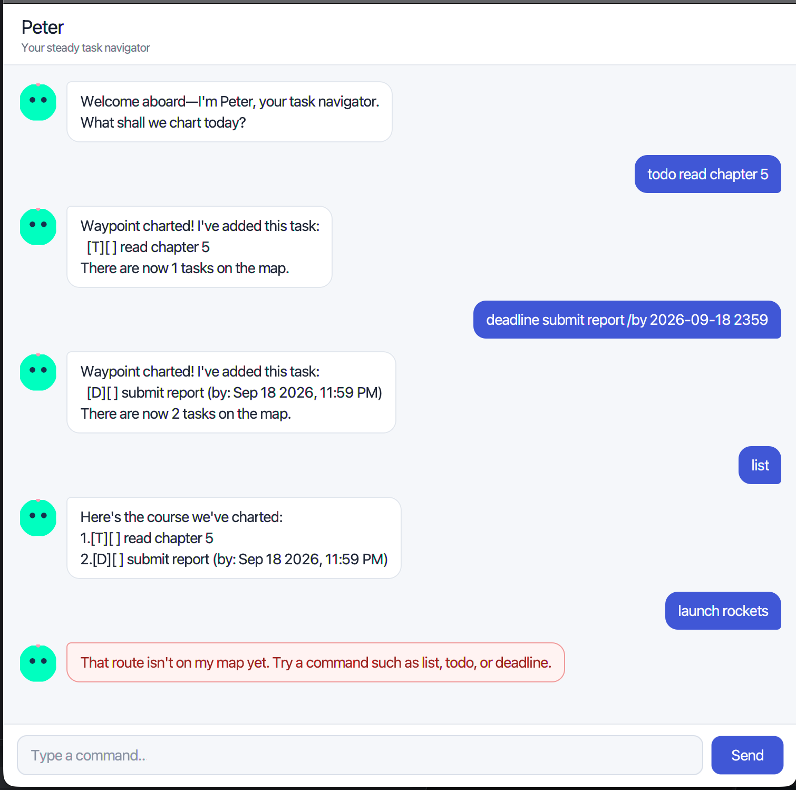

# Peter User Guide

Peter is a calm task navigator that helps you record todos, deadlines, and events from a compact chat-style
interface. Your tasks are saved automatically, so they remain available the next time Peter starts.



## Quick start

1. Install Java 25.
2. Download `peter.jar` from the latest GitHub release.
3. Put the JAR in a folder where Peter may create a `data` subfolder.
4. Open a terminal in that folder and run:

   ```bash
   java -jar peter.jar
   ```

5. Type a command in the field at the bottom and press Enter or click **Send**.

Peter accepts extra spaces around words and shows incorrect commands in a red message. Dates use `yyyy-MM-dd`,
while event times use 24-hour `HHmm` format.

## Adding a todo

Use `todo DESCRIPTION` for a task without a date or time.

```text
todo read chapter 5
```

Peter adds the todo and reports the new number of tasks.

## Adding a deadline

Use `deadline DESCRIPTION /by DATE TIME`. The time is optional; a date without a time is treated as 11:59 PM.

```text
deadline submit report /by 2026-09-18 2359
deadline renew library book /by 2026-09-20
```

Peter rejects impossible dates such as February 30.

## Adding an event

Use `event DESCRIPTION /from START /to END`. The end time must be later than the start time.

```text
event project meeting /from 1400 /to 1600
```

## Viewing all tasks

Use `list` to display every task and its number.

```text
list
```

The status box is blank for an incomplete task and contains `X` for a completed task.

## Marking and unmarking tasks

Use the number shown by `list`.

```text
mark 2
unmark 2
```

`mark` records a task as complete, while `unmark` returns it to the incomplete state.

## Deleting a task

Use `delete NUMBER` to remove one task.

```text
delete 3
```

Peter shows the removed task and the number of remaining tasks.

## Finding tasks

Use `find KEYWORD` to search task descriptions. Searching is not case-sensitive.

```text
find book
```

## Viewing deadlines on a date

Use `view DATE` to display deadlines on one date.

```text
view 2026-09-18
```

## Sorting deadlines

Use `sort` to arrange deadlines from earliest to latest. Todos and events remain after the deadlines in their
existing relative order.

```text
sort
```

## Exiting Peter

Use `bye` to close the application.

```text
bye
```

## Data and error recovery

Peter stores tasks in `data/peter.txt`, relative to the folder from which the JAR is launched. If the file does
not exist, Peter starts with an empty list and creates it when the first task is saved. Damaged or duplicate
entries are skipped, while valid entries are recovered. If Peter cannot read or write the file, it displays a
warning instead of terminating unexpectedly.

Do not edit the data file while Peter is running. If you need to move your tasks, close Peter and copy the whole
`data` folder together with the JAR.

## Command summary

- `todo DESCRIPTION`
- `deadline DESCRIPTION /by yyyy-MM-dd [HHmm]`
- `event DESCRIPTION /from HHmm /to HHmm`
- `list`
- `mark NUMBER`
- `unmark NUMBER`
- `delete NUMBER`
- `find KEYWORD`
- `view yyyy-MM-dd`
- `sort`
- `bye`
